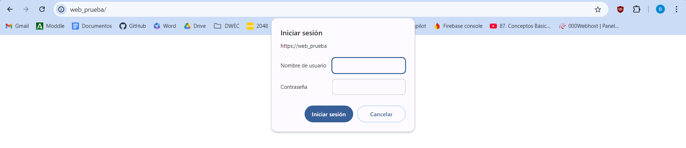
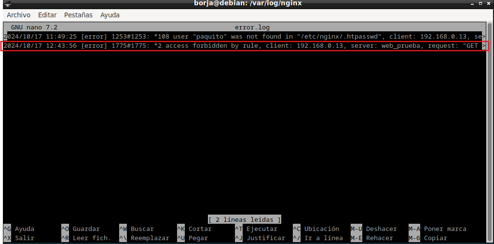
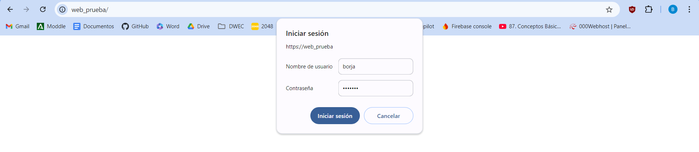

# Práctica 2.2 – Autenticación en Nginx

### Paquetes necesarios

Para esta práctica podemos utilizar la herramienta openssl para crear las contraseñas.

En primer lugar debemos comprobar si el paquete está instalado:

```
dpkg -l | grep openssl
```

Y si no lo estuviera, instalarlo.

### Creación de usuarios y contraseñas para el acceso web
Creamos un archivo oculto llamado “.htpasswd” en el directorio de configuración /etc/nginx donde guardar nuestros usuarios y contraseñas:

```
sudo sh -c "echo -n 'vuestro_nombre:' >> /etc/nginx/.htpasswd"
```
Ahora crearemos un pasword cifrado para el usuario:

```
sudo sh -c "openssl passwd -apr1 >> /etc/nginx/.htpasswd"
```

Este proceso se podrá repetir para tantos usuarios como haga falta.

Crea dos usuarios, uno con tu nombre y otro con tu primer apellido
Comprueba que el usuario y la contraseña aparecen cifrados en el fichero:
```
cat /etc/nginx/.htpasswd
```


### Configurando el servidor Nginx para usar autenticación básica

Editaremos la configuración del server block sobre el cual queremos aplicar la restricción de acceso.

```
sudo nano /etc/nginx/sites-available/nombre_web
```
Utilizaremos la directiva `auth_basic` dentro del location y le pondremos el nombre a nuestro dominio que será mostrado al usuario al solicitar las credenciales. Por último, configuramos Nginx para que utilice el fichero que previamente hemos creado con la directiva `auth_basic_user_file`:


Una vez terminada la configuración, reiniciamos el servicio.
```
sudo systemctl restart nginx
```

### Comprobación 1

Comprueba desde tu máquina física/anfitrión que puedes acceder a http://nombre-sitio-web y que se te solicita autenticación



### Comprobación 2

Comprueba que si decides cancelar la autenticación, se te negará el acceso al sitio con un error. ¿Qué error es?


### Tarea 1

Intenta entrar primero con un usuario erróneo y luego con otro correcto. Puedes ver todos los sucesos y registros en los logs access.log y error.log

Adjunta una captura de pantalla de los logs donde se vea que intentas entrar primero con un usuario inválido y con otro válido. Indica dónde podemos ver los errores de usuario inválido o no encontrado, así como donde podemos ver el número de error que os aparecía antes

Usuario inválido:

access.log

error.log:


Usuario válido:

access.log

error.log:
No hay error ya que el usuario es válido.

### Tarea 2

Borra las dos líneas que hacen referencia a la autenticación básica en el location del directorio raíz. Tras ello, añade un nuevo location debajo con la autenticación básica para el archivo/sección contact.html únicamente.


### Combinación de la autenticación básica con la restricción de acceso por IP

### Tarea 1

Configura Nginx para que no deje acceder con la IP de la máquina anfitriona al directorio raíz de una de tus dos webs. Modifica su server block o archivo de configuración. Comprueba como se deniega el acceso:


Al intentar acceder nos encontramos con error


error.log:


### Tarea 2

Configura Nginx para que desde tu máquina anfitriona se tenga que tener tanto una IP válida como un usuario válido, ambas cosas a la vez, y comprueba que sí puede acceder sin problemas




### Cuestión 1

Supongamos que yo soy el cliente con la IP 172.1.10.15 e intento acceder al directorio web_muy_guay de mi sitio web, equivocándome al poner el usuario y contraseña. ¿Podré acceder?¿Por qué?

```
location /web_muy_guay {
    #...
    satisfy all;    
    deny  172.1.10.6;
    allow 172.1.10.15;
    allow 172.1.3.14;
    deny  all;
    auth_basic "Cuestión final 1";
    auth_basic_user_file conf/htpasswd;
}
```

No, porque aunque la ip sea admitida, debe satisfacer todos los métodos de autentificación como indica el `satisfy all`

### Cuestión 2

ask "Cuestión 1" Supongamos que yo soy el cliente con la IP 172.1.10.15 e intento acceder al directorio web_muy_guay de mi sitio web, introduciendo correctamente usuari y contraseña. ¿Podré acceder?¿Por qué?

```
location /web_muy_guay {
    #...
    satisfy all;    
    deny  all;
    deny  172.1.10.6;
    allow 172.1.10.15;
    allow 172.1.3.14;

    auth_basic "Cuestión final 2: The revenge";
    auth_basic_user_file conf/htpasswd;
}
```

En este caso, aunque introduzcamos correctamente el usuario y contraseña, al estar `deny all` al principio del todo deniega el acceso a todas las ips. Por lo que no podríamos acceder.

### Cuestión 3

Supongamos que yo soy el cliente con la IP 172.1.10.15 e intento acceder al directorio web_muy_guay de mi sitio web, introduciendo correctamente usuario y contraseña. ¿Podré acceder?¿Por qué?

```
location /web_muy_guay {
    #...
    satisfy any;    
    deny  172.1.10.6;
    deny 172.1.10.15;
    allow 172.1.3.14;

    auth_basic "Cuestión final 3: The final combat";
    auth_basic_user_file conf/htpasswd;
}
```

No, porque nuestra ip está denegada.

### Cuestión 4
A lo mejor no sabéis que tengo una web para documentar todas mis excursiones espaciales con Jeff, es esta: Jeff Bezos y yo

Supongamos que quiero restringir el acceso al directorio de proyectos porque es muy secreto, eso quiere decir añadir autenticación básica a la URL:Proyectos

Completa la configuración para conseguirlo:

```
    server {
        listen 80;
        listen [::]:80;
        root /var/www/freewebsitetemplates.com/preview/space-science;
        index index.html index.htm index.nginx-debian.html;
        server_name freewebsitetemplates.com www.freewebsitetemplates.com;
        location /Proyectos{
            auth_basic "Cuestión final 4";
            auth_basic_user_file conf/htpasswd;
            try_files $uri $uri/ =404;
        }
    }
```